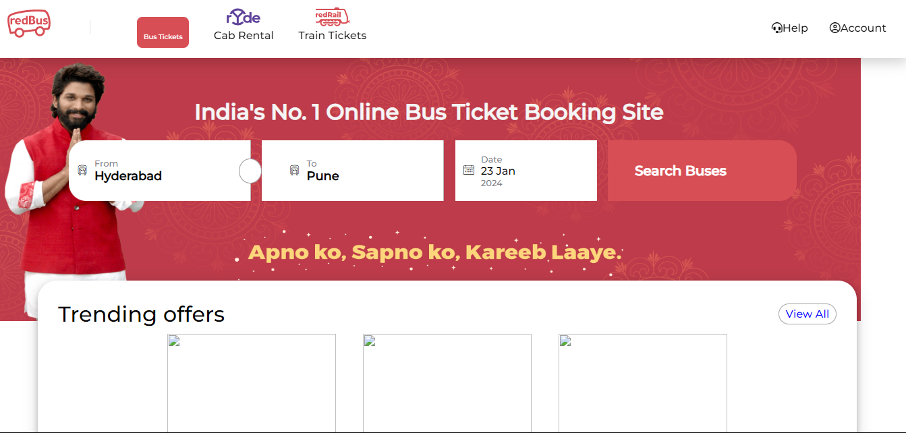

# Hi, I'm Harsh Mishra ! 👋

## 🚀 I'm a full-stack developer...

## Project Title - Rocket Site

 Welcome to the RedBus Clone project! This web application is a simplified replica of the popular RedBus online bus ticket booking platform. It allows users to search for buses, book tickets, view available seats, and manage bookings.

## 🌟 Features

+ **Bus Search**: Users can search for buses based on source, destination, and date.
+ **Seat Selection**: View bus layout and choose your preferred seats.
+ **User Authentication**: Sign up, log in, and manage bookings with secure user authentication.
+ **Payment Gateway**: Simulate a payment process for booking confirmation.
+ **Booking History**: View previous bookings and their statuses.
+ **Mobile-Responsive**: The application is fully responsive and works seamlessly on all devices.

## Average time to complete
#### 2 days.

## Technology Used

## 🛠 Skills
HTML, CSS

## 📱 Responsive Design

This project is built with mobile-first design principles. The application is fully responsive and ensures a smooth user experience across all screen sizes, from mobile phones to large desktops.

## Demo | Netlify
https://cerulean-pony-2029f1.netlify.app/

## Screenshots

## 🤝 Contributing

  Contributions are welcome! If you would like to contribute to this project, feel free to submit a pull request or open an issue. Whether it’s bug fixes, new features, or improvements, your help will keep this clone running smoothly.

## 📫 Contact

For any questions, suggestions, or feedback, feel free to reach out:

Email: hm45676777776@gmail.com

GitHub: HarshMishra23

